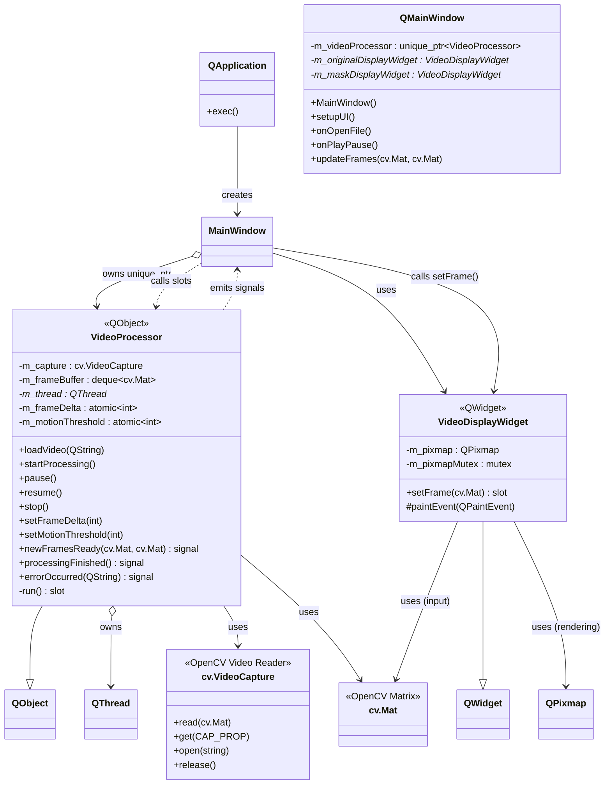
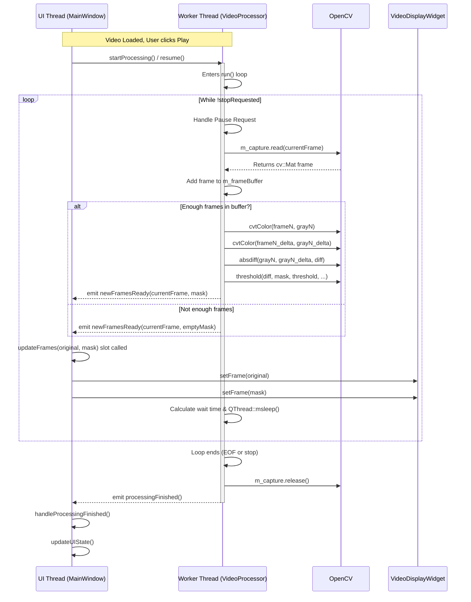

# Motplayer

## Introduction

Motplayer (Motion Video Player) is a cross-platform C++ application designed to play video files while simultaneously analyzing and visualizing motion between frames in real-time. It displays the original video alongside a dynamically generated "motion mask" video, highlighting areas where significant pixel changes occur over a configurable time delta.

This application leverages the power of **Qt 6** for its graphical user interface and threading, and **OpenCV 4** for video decoding and image processing (matrix operations). It uses **CMake** as its build system, facilitating compilation on Linux and Windows platforms.

## Features

* Plays standard video file formats (using OpenCV's backend, e.g., MP4, AVI, MKV).
* Real-time motion detection between frames.
* Generates a binary motion mask based on pixel differences.
* Side-by-side playback of the original video and the motion mask.
* Configurable **Frame Delta**: Adjust the number of frames between comparisons (e.g., compare frame N and N-3).
* Configurable **Motion Threshold**: Adjust the sensitivity for detecting pixel changes.
* Cross-platform: Designed to build and run on Linux (x86_64) and Windows (x86_64).
* Uses a separate thread for video processing to keep the UI responsive.

## Dependencies

* **C++ Compiler:** Supporting C++17 or later (e.g., GCC, Clang, MSVC).
* **CMake:** Version 3.16 or later.
* **Qt Framework:** Version 6.x (e.g., 6.8 LTS, 6.9 or later).
    * Required Modules: `Core`, `Gui`, `Widgets`.
    * **Recommendation:** Use the **Official Qt Online Installer** (Open Source option) to get precise version control across platforms.
* **OpenCV:** Version 4.x (e.g., 4.6.0 or later).
    * Required Modules (typically included): `core`, `imgproc`, `highgui`, `videoio`.

## Build Instructions

The project uses CMake for building.

**1. Clone the Repository (if applicable):**

```bash
git clone git@github.com:Ether-G/motplayer.git
cd motplayer
```

**2. Create a Build Directory:**

```bash
mkdir build
cd build
```

**3. Run CMake:**

Crucial Step (If using Qt Online Installer): You must tell CMake where to find your Qt installation using CMAKE_PREFIX_PATH. Replace /path/to/your/Qt/6.x.y/gcc_64 with the actual path on your system.

Linux Example:

```bash
# --- ADJUST THE CMAKE_PREFIX_PATH ---
cmake .. -DCMAKE_PREFIX_PATH=/home/your_user/Qt/6.9.0/gcc_64
```

(Alternatively, export the variable: `export CMAKE_PREFIX_PATH=/path/to/qt; cmake ..`)

Windows Example (using Visual Studio Generator):

```bash
# --- ADJUST PATHS for Qt and OpenCV ---
# (Assuming OpenCV is also installed somewhere CMake can't find automatically)
cmake .. -G "Visual Studio 17 2022" ^
         -DCMAKE_PREFIX_PATH="C:/Qt/6.9.0/msvc2019_64" ^
         -DOpenCV_DIR="C:/path/to/opencv/build"
```

If using system Qt/OpenCV (installed via package manager like apt): You might not need to specify CMAKE_PREFIX_PATH or OpenCV_DIR if CMake can find them automatically.

```bash
cmake ..
```

**4. Compile:**

Linux (Makefiles - default):
```bash
make -j$(nproc)
```

Windows (Visual Studio): Open the generated .sln file in the build directory with Visual Studio and build the MotionVideoPlayer target. Or use CMake's build tool mode:
```bash
cmake --build . --config Release # Or Debug
```

**5. Run:**

Linux: The executable MotionVideoPlayer will be in the build directory.
```bash
./MotionVideoPlayer
```

Windows: The executable MotionVideoPlayer.exe will be in the build\Release or build\Debug subdirectory (depending on the configuration built). You might need to ensure Qt and OpenCV DLLs are accessible (e.g., by copying them next to the executable or adding their bin directories to the system PATH).

## Usage

1. Launch the MotionVideoPlayer executable.
2. Click the "Open Video" button or use the File -> Open Video... menu item to select a video file.
3. Information about the loaded video (resolution, FPS) will appear in the control panel.
4. Click the "Play" button (or use Control -> Play) to start playback and motion analysis. The button will change to "Pause".
5. The left panel shows the original video frame.
6. The right panel shows the calculated motion mask (white pixels indicate motion above the threshold).
7. Adjust the "Frame Delta" using the spin box to change how far back (in frames) the comparison is made.
8. Adjust the "Motion Threshold" slider to control the sensitivity of motion detection (lower values are more sensitive).
9. Click "Pause" to pause playback. Click "Play" again to resume.
10. You can open a different video file while playback is stopped or paused.

## Video Example

https://github.com/user-attachments/assets/c07ebc6b-47f9-4502-ad3a-c4a2c1155c56


## Architecture Overview

The application uses a multi-threaded approach to separate the UI responsiveness from the potentially intensive video processing.

- **MainWindow**: Manages the main application window, UI controls (buttons, sliders), and overall state. It runs in the main UI Thread. It creates and owns the VideoProcessor.
- **VideoProcessor**: Handles loading the video file, reading frames, performing the motion detection logic (frame differencing, thresholding), and managing frame timing. It runs entirely in a separate Worker Thread (QThread) to avoid blocking the UI. It communicates results back to MainWindow using Qt's thread-safe signals and slots.
- **VideoDisplayWidget**: A simple custom widget responsible for taking a cv::Mat frame and rendering it efficiently using QPainter. Two instances are used in MainWindow. These run in the UI Thread.
- **Qt Signals/Slots**: Used for communication between MainWindow (UI Thread) and VideoProcessor (Worker Thread). For example, VideoProcessor emits newFramesReady(cv::Mat, cv::Mat), which MainWindow receives in its thread and uses to update the VideoDisplayWidgets.

## Class Diagram



## Execution Flow (Processing Loop)



## License

This project is licensed under the MIT License.
